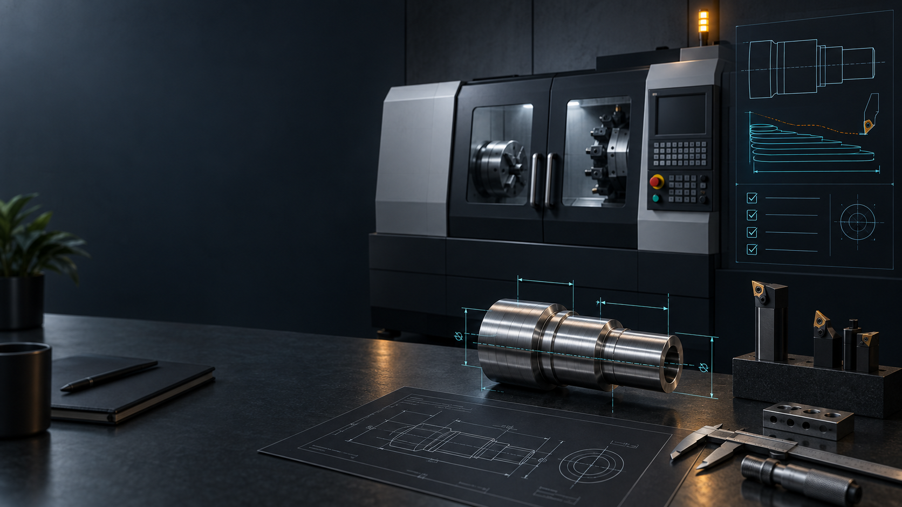

# Mastercam MCP



[Watch the sample data walkthrough](media/overview/out/mastercam_overview.mp4)

[View a sample NC review image](media/overview/out/unknowns_review.png)

MCP means Model Context Protocol. It lets an AI assistant request information from other software through named tools. Mastercam MCP connects those tools to a local Mastercam session. It can inspect a job, show a proposed change to an operator, then check the result.

You can also run the portable tools without Mastercam. That mode uses sample data. Use it to learn the workflow. Use it to check the software. It does not prove that a real Mastercam job will behave the same way.

## What it can do today

The local tools review job data that you provide. They compare tool lists. They check supported moves in an NC program, which is machine code. They estimate time from listed moves. They calculate thread guidance from confirmed dimensions. They create setup notes. They suggest tools from a catalog you provide. They draft an outside diameter turning plan.

The turning plan is a proposal. It does not create a Mastercam operation. It does not make machine code. Thread guidance needs a confirmed thread size. Confirmed dimensions work too. NC review reports unknown moves when it cannot understand a command. An unknown result gives no safety conclusion. Mastercam Verify remains necessary. Machine simulation remains necessary. A shop prove out remains necessary.

On a licensed Windows workstation, the native add in has a limited read path. Mastercam 2027 has an optional operation snapshot. That snapshot remains under acceptance testing. The older adapter reports the environment only. The server labels each capability with its tested level.

## Choose how to run it

| Mode | What you need | What it proves |
| --- | --- | --- |
| Sample mode | Node.js 22+ | Tries the workflow with sample data |
| Local file review | Node.js 22+ plus exported job data | Reviews the data you supplied |
| Mastercam status | Windows, licensed Mastercam, matching integration files | Reports the installed Mastercam environment |
| Mastercam 2027 read candidate | The same items plus a supervised acceptance run | Reads a limited operation list on that workstation |

A passing sample check does not prove live Mastercam access. The Mastercam 2027 read candidate does not prove that every job detail is available. Stock data remains outside verified coverage. Work offset settings remain outside verified coverage. Cutting paths remain outside verified coverage. Machine simulation remains outside verified coverage.

## Try the fixture

Install Node.js 22+. Open this project in a terminal. Run the commands below.

```text
pnpm install
pnpm run build
pnpm test
pnpm run smoke
```

Sample mode uses synthetic job data. It cannot modify a real Mastercam document.

## Install status

The GitHub source contains work that is newer than the npm package. At the time this page was updated, npm `latest` resolves to 0.2.0. Version 0.3.0 is not available on npm. The npm latest command does not install the current source changes.

Install GitHub CLI before running this source checkout command. On Windows, open PowerShell. On macOS, use Terminal. Linux users can use their usual terminal.

```text
gh repo clone Praket7/mastercam-mcp
cd mastercam-mcp
git switch feat/full-manufacturing-automation
pnpm install
pnpm run build
node dist/cli.js serve
```

The feature branch is under review. It may change before release. GitHub releases have a different download path than npm packages.

## Connect Mastercam on Windows

A live connection needs a licensed Windows copy of Mastercam. It needs matching local NET Hook files. Install the .NET SDK required by that release. The installer needs administrator approval to copy the add in into the protected Mastercam folder.

Set `MASTERCAM_MCP_ENABLE_STAGE_B_READS` to `1` in the shell that starts Mastercam. The add in reads this setting when the application starts.

Keep the server read only during initial checks. Run the live acceptance command from the same workstation. The report separates a working operation snapshot from complete live inspection. Only a licensed acceptance run can confirm the native connection.

## Write protection

The server starts read only. A write profile alone does not allow a change. Set `MASTERCAM_MCP_PROFILE` to `write`. Set `MASTERCAM_MCP_HARD_READ_ONLY` to `0` to opt in.

Before a change, the server creates a preview tied to the operation plus document revision. The MCP client must show the exact before/after values to the operator. The server checks the document again before apply. If the connected client cannot show an approval request, the change is refused.

Posting is not available. Machine control is not available. Program transfer is not available. Cycle start is not available. Arbitrary code execution is not available.

## What the analysis does not prove

The NC reader checks a limited set of common straight moves plus circular moves. Unsupported cycles remain unknown. Macros remain unknown. Coordinate transforms remain unknown. Rotary moves remain unknown. Controller behavior remains unknown. Missing offsets skip some travel checks. Unknown means the program needs another review.

A shop JSON file can supply the tool catalog. A supported manufacturer feed works too. The server does not open proprietary `.TOOLDB` files. Thread calculations use dimensions you provide. The server does not read thread features from CAD. A turning plan is a structured proposal. It is not an executable toolpath.

These limits protect the meaning of the output. A useful review can flag concerns. It cannot certify a program as safe to run.

## Learn more

[Installation steps](docs/INSTALLATION.md) explain setup on Windows, macOS, Linux.

[Shop workflows](docs/SHOP-FLOOR.md) explain setup notes, tool lists, NC comparisons, machine checks.

[Capability status](docs/CAPABILITIES.md) lists each feature with its current evidence level.

[Full readiness review](docs/FULL-AUTOMATION-READINESS.md) records release gaps, unverified features, remaining acceptance work.

[Security policy](SECURITY.md) explains how to report a security issue.
